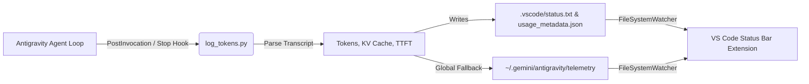

# Antigravity Token Telemetry for VS Code

[](https://opensource.org/licenses/MIT)
[](https://code.visualstudio.com/)
[](https://github.com/)

A lightweight, zero-dependency telemetry monitor that displays live model name, conversation context tokens, turn delta, latency (TTFT), and prompt KV cache hits directly inside the native VS Code Status Bar.

---

## 📸 Preview

```text
Gemini 3.8 Flash | $(sparkle) 44.0k (+4.3k) | $(database) 39.7k (90%) cached | TTFT ~1.0s
```

### Rich Hover Tooltip
Hovering over the status bar item reveals a clean breakdown:
* **Model:** `Gemini 3.8 Flash`
* **Total Context:** `44,046` tokens (`+4.3k`)
* **Prompt Tokens:** `43,944`
* **Candidate (Output) Tokens:** `102`
* **KV Cache Hit:** `39,726` (`90%`)
* **Latency (TTFT):** `~1.0s`
* **Steps Executed:** `211`

### Interactive QuickPick Inspection
Clicking the status bar item opens an interactive modal menu to inspect all metrics or jump directly to the raw `usage_metadata.json` file.

---

## 🏗️ Architecture



The system is decoupled into two lightweight components:
1. **Antigravity Lifecycle Hook** (`hook/log_tokens.py`): Runs automatically after agent turns, analyzes the session transcript, and computes prompt/candidate tokens, KV cache hit percentages, and TTFT latency.
2. **VS Code Extension** (`extension.js`): Pure JavaScript client that watches the status files and updates the status bar in real time without polling.

---

## ⚡ Quick Start

### 1. One-Click Install
Clone this repo and run the installer script:
```bash
git clone https://github.com/Santiagus/antigravity-token-telemetry.git
cd antigravity-token-telemetry
./scripts/install.sh
```

This will:
1. Package the extension into `dist/antigravity-token-telemetry-1.0.0.vsix`.
2. Install the Antigravity lifecycle hook globally into `~/.gemini/config/plugins/antigravity-token-telemetry/` so it automatically tracks **all** projects.
3. Install the `.vsix` into VS Code.

---

### 2. Manual Installation

#### Step A: Install Antigravity Hook
Copy the hook files to your global Antigravity plugins directory:
```bash
mkdir -p ~/.gemini/config/plugins/antigravity-token-telemetry
cp hook/* ~/.gemini/config/plugins/antigravity-token-telemetry/
chmod +x ~/.gemini/config/plugins/antigravity-token-telemetry/log_tokens.py
```

*(Alternatively, to enable for a single project only, copy `hook/hooks.json` and `hook/log_tokens.py` into your project's `.agents/` folder).*

#### Step B: Install VS Code Extension
1. Build the package:
   ```bash
   python3 scripts/build_vsix.py
   ```
2. In VS Code:
   - Open Command Palette (`Ctrl+Shift+P` / `Cmd+Shift+P`)
   - Select **Extensions: Install from VSIX...**
   - Choose `dist/antigravity-token-telemetry-1.0.0.vsix`

---

## ⚙️ Extension Settings

| Setting | Type | Default | Description |
| :--- | :--- | :--- | :--- |
| `antigravity.statusBar.alignment` | `string` | `"right"` | Alignment in the status bar (`"left"` or `"right"`). |
| `antigravity.statusBar.priority` | `integer` | `100` | Order priority of the status bar item. |
| `antigravity.statusBar.fallbackToGlobal` | `boolean` | `true` | Reads global Antigravity telemetry if no workspace file is found. |

---

## 🛠️ Development

- **No Node.js / npm required to build**: The `.vsix` packager is written in standard Python (`scripts/build_vsix.py`).
- To re-build the package:
  ```bash
  python3 scripts/build_vsix.py
  ```

---

## 📄 License

MIT License. See [LICENSE](LICENSE) for details.
