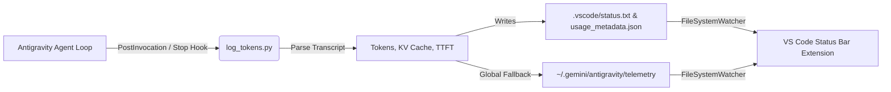

# Antigravity Token Telemetry for VS Code

[](https://opensource.org/licenses/MIT)
[](https://code.visualstudio.com/)
[](https://github.com/)

A lightweight, zero-dependency telemetry monitor that displays live model name, conversation context tokens, turn delta, latency (TTFT), and prompt KV cache hits directly inside the native VS Code Status Bar.

---

## 📸 Preview

```text
Gemini 3.8 Flash | 🟢 Tokens 44.0k (+4.3k) | 🟢 90% cache hit | 🟢 TTFT ~1.0s
```

* **Clear, compact labeling**: Each metric is paired with its semaphore dot (`🟢`, `🟡`, `🔴`) and clean label: `Tokens`, `% cache hit`, and `TTFT`.
* **Worst-case background alert**: If any metric enters warning or critical state, the status bar item background turns yellow (`warningBackground`) or red (`errorBackground`).

### 🚦 Independent Multi-Metric Health Monitoring
Each metric diagnoses a different bottleneck independently:
* **Context Footprint (`totalTokens`)**: `🟢 <100k` (Optimal) | `🟡 100k-200k` (Heavy) | `🔴 >200k` (Critical load).
* **KV Cache Hit %**: `🟢 >=70%` (Optimal reuse) | `🟡 40-69%` (Moderate) | `🔴 <40%` (Prefix invalidation detected).
* **Latency (TTFT)**: `🟢 <2.5s` (Fast response) | `🟡 2.5s-4.5s` (Elevated) | `🔴 >4.5s` (High delay/stalling).

### 💡 Combination-Aware Hover Tooltip
Hovering over the status bar item displays an intelligent diagnosis that considers metric combinations:
* *Example (High Context + Fast TTFT + High Cache)*: Recognizes that cost and speed are mitigated by prompt caching, advising that the primary remaining risk is **attention dilution** across complex tasks.
* *Example (Low Cache Hit)*: Flags prompt prefix invalidation caused by dynamic instructions or changing files early in the prompt.
* *Scorecard Breakdown*: Displays per-metric grades and stats cleanly.

### 🔔 Critical State Notification Popup
A non-intrusive VS Code notification popup appears when your session transitions into a critical state, with quick actions to start a new session or configure thresholds.

### Interactive QuickPick Inspection
Clicking the status bar item opens an interactive modal menu to inspect all metrics, review health advice with one-click settings access, or jump directly to the raw `usage_metadata.json` file.

---

## 🏗️ Architecture



The system is decoupled into two lightweight components:
1. **Antigravity Lifecycle Hook** (`hook/log_tokens.py`): Runs automatically after agent turns, analyzes the session transcript, and computes prompt/candidate tokens, KV cache hit percentages, and TTFT latency.
2. **VS Code Extension** (`extension.js`): Pure JavaScript client that watches the status files and updates the status bar in real time without polling.

---

## ⚡ Quick Start

### 1. One-Click Install
Clone this repo and run the installer script:
```bash
git clone https://github.com/Santiagus/antigravity-token-telemetry.git
cd antigravity-token-telemetry
./scripts/install.sh
```

This will:
1. Package the extension into `dist/antigravity-token-telemetry-1.0.0.vsix`.
2. Install the Antigravity lifecycle hook globally into `~/.gemini/config/plugins/antigravity-token-telemetry/` so it automatically tracks **all** projects.
3. Install the `.vsix` into VS Code.

---

### 2. Manual Installation

#### Step A: Install Antigravity Hook
Copy the hook files to your global Antigravity plugins directory:
```bash
mkdir -p ~/.gemini/config/plugins/antigravity-token-telemetry
cp hook/* ~/.gemini/config/plugins/antigravity-token-telemetry/
chmod +x ~/.gemini/config/plugins/antigravity-token-telemetry/log_tokens.py
```

*(Alternatively, to enable for a single project only, copy `hook/hooks.json` and `hook/log_tokens.py` into your project's `.agents/` folder).*

#### Step B: Install VS Code Extension
1. Build the package:
   ```bash
   python3 scripts/build_vsix.py
   ```
2. In VS Code:
   - Open Command Palette (`Ctrl+Shift+P` / `Cmd+Shift+P`)
   - Select **Extensions: Install from VSIX...**
   - Choose `dist/antigravity-token-telemetry-1.0.0.vsix`

---

## ⚙️ Extension Settings
 
| Setting | Type | Default | Description |
| :--- | :--- | :--- | :--- |
| `antigravity.statusBar.alignment` | `string` | `"right"` | Alignment in the status bar (`"left"` or `"right"`). |
| `antigravity.statusBar.priority` | `integer` | `100` | Order priority of the status bar item. |
| `antigravity.statusBar.fallbackToGlobal` | `boolean` | `true` | Reads global Antigravity telemetry if no workspace file is found. |
| `antigravity.statusBar.enableHealthColors` | `boolean` | `true` | Color status bar item with warning/error backgrounds based on context health. |
| `antigravity.statusBar.warningThreshold` | `integer` | `100000` | Token threshold (yellow warning background) indicating context footprint is getting heavy. |
| `antigravity.statusBar.criticalThreshold` | `integer` | `200000` | Token threshold (red error background) recommending a fresh chat or context optimization. |
| `antigravity.statusBar.cacheWarningThreshold` | `integer` | `70` | KV cache hit percentage below which a warning indicator (yellow) is shown. |
| `antigravity.statusBar.cacheCriticalThreshold` | `integer` | `40` | KV cache hit percentage below which a critical indicator (red) is shown. |
| `antigravity.statusBar.ttftWarningThreshold` | `number` | `2.5` | Time to First Token (seconds) above which a warning indicator (yellow) is shown. |
| `antigravity.statusBar.ttftCriticalThreshold` | `number` | `4.5` | Time to First Token (seconds) above which a critical indicator (red) is shown. |
| `antigravity.statusBar.enableCriticalAlertPopup` | `boolean` | `true` | Display a notification message popup when any metric enters a critical state. |

---

## 🛠️ Development

- **No Node.js / npm required to build**: The `.vsix` packager is written in standard Python (`scripts/build_vsix.py`).
- To re-build the package:
  ```bash
  python3 scripts/build_vsix.py
  ```

---

## 📄 License

MIT License. See [LICENSE](LICENSE) for details.
