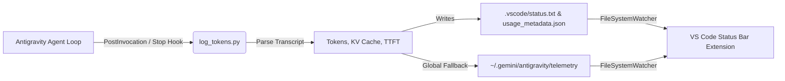

# Antigravity Token Telemetry for VS Code

[](https://opensource.org/licenses/MIT)
[](https://code.visualstudio.com/)
[](https://github.com/)

A lightweight, zero-dependency telemetry monitor that displays live model name, conversation context tokens, turn delta, latency (TTFT), and prompt KV cache hits directly inside the native VS Code Status Bar.

---

## 📸 Preview

```text
Gemini 3.8 Flash | 🟢 Tokens 44.0k (+4.3k) | 🟢 90% cache hit | 🟢 TTFT ~1.0s
```

* **Clear, compact labeling**: Each metric is paired with its semaphore dot (`🟢`, `🟡`, `🔴`) and clean label: `Tokens`, `% cache hit`, and `TTFT`.
* **Worst-case background alert**: If any metric enters warning or critical state, the status bar item background turns yellow (`warningBackground`) or red (`errorBackground`).

### 🚦 Independent Multi-Metric Health Monitoring
Each metric diagnoses a different bottleneck independently:
* **Context Footprint (`totalTokens`)**: `🟢 <100k` (Optimal) | `🟡 100k-200k` (Heavy) | `🔴 >200k` (Critical load).
* **KV Cache Hit %**: `🟢 >=70%` (Optimal reuse) | `🟡 40-69%` (Moderate) | `🔴 <40%` (Prefix invalidation detected).
* **Latency (TTFT)**: `🟢 <2.5s` (Fast response) | `🟡 2.5s-4.5s` (Elevated) | `🔴 >4.5s` (High delay/stalling).

### 🔬 Technical Diagnosis & Actionable Advice
Hovering over the status bar item displays a verbose Markdown tooltip clearly separated into:
* **🔬 Technical Diagnosis**: Explains the technical cause (e.g. cumulative tokens, KV cache prefix invalidation, attention dilution, or reasoning queueing).
* **💡 Actionable Advice**: Concrete instructions on what to do (e.g. `/clear` or fresh session, pruning instructions in `.agents/`, optimizing skill prefixes).
* **🚦 Telemetry Scorecard**: Visual breakdown of per-metric status dots and readings.
* **ℹ️ Session Footprint**: Complete model, prompt/candidate token counts, steps, and last turn timestamp.

### 🔔 Brief Recommended Action Alert Popups
When a situation is detected that calls for starting a new chat or optimizing agent/skill files (e.g. critical token load, low cache prefix invalidation, or heavy context):
* A brief, non-intrusive VS Code warning popup appears with the recommended action (e.g., *"Antigravity Telemetry: Start a fresh chat session immediately to avoid high latency and token costs"*).
* Popups remain concise to preserve screen focus, while the status bar hover tooltip provides the full deep-dive diagnosis.
* Alert popups can be toggled on or off anytime via settings (`antigravity.statusBar.enableCriticalAlertPopup`).

### 📱 Interactive QuickPick Inspection
Clicking the status bar item opens an interactive modal menu allowing you to:
* View detailed metric scorecards and full token counters.
* Open the **Health Diagnosis & Advice** dialog with one-click access to settings.
* Launch the **Scenario Simulator** to preview different alert states.
* Open the raw `usage_metadata.json` file directly in the editor.

---

## 🧪 Testing & Simulating Scenarios

You can verify the status bar colors, verbose hover tooltips, and brief alert popups without waiting for a live agent session:

1. Press `Ctrl+Shift+P` (or `Cmd+Shift+P` on macOS).
2. Run **`Antigravity Telemetry: Simulate Scenario`** (or click the status bar item and select `🧪 Simulate Scenario...`).
3. Select any built-in scenario:
   * **🟢 Optimal (All Healthy)**: Compact context, 90% cache hit, ~1.0s TTFT.
   * **🔴 Attention Dilution**: High context (>200k) with fast TTFT & high cache.
   * **🛑 Critical Load**: High context (>200k) + low cache (<40%) + high TTFT (>4.5s).
   * **🔴 Prefix Invalidation**: Low cache hit (<40%) diagnosing unstable prompt prefixes.
   * **🟡 Heavy Context**: Context crossing the warning threshold (100k-200k).

---

## 🏗️ Architecture



The system is decoupled into two lightweight components:
1. **Antigravity Lifecycle Hook** (`hook/log_tokens.py`): Runs automatically after agent turns, analyzes the session transcript, and computes prompt/candidate tokens, KV cache hit percentages, and TTFT latency.
2. **VS Code Extension** (`extension.js`): Pure JavaScript client that watches the status files and updates the status bar in real time without polling.

---

## ⚡ Quick Start

### 1. One-Click Install
Clone this repo and run the installer script:
```bash
git clone https://github.com/Santiagus/antigravity-token-telemetry.git
cd antigravity-token-telemetry
./scripts/install.sh
```

This will:
1. Package the extension into `dist/antigravity-token-telemetry-1.1.3.vsix`.
2. Install the Antigravity lifecycle hook globally into `~/.gemini/config/plugins/antigravity-token-telemetry/` so it automatically tracks **all** projects.
3. Install the `.vsix` into VS Code.

---

### 2. Manual Installation

#### Step A: Install Antigravity Hook
Copy the hook files to your global Antigravity plugins directory:
```bash
mkdir -p ~/.gemini/config/plugins/antigravity-token-telemetry
cp hook/* ~/.gemini/config/plugins/antigravity-token-telemetry/
chmod +x ~/.gemini/config/plugins/antigravity-token-telemetry/log_tokens.py
```

*(Alternatively, to enable for a single project only, copy `hook/hooks.json` and `hook/log_tokens.py` into your project's `.agents/` folder).*

#### Step B: Install VS Code Extension
1. Build the package:
   ```bash
   python3 scripts/build_vsix.py
   ```
2. In VS Code:
   - Open Command Palette (`Ctrl+Shift+P` / `Cmd+Shift+P`)
   - Select **Extensions: Install from VSIX...**
   - Choose `dist/antigravity-token-telemetry-1.1.3.vsix`

---

## ⌨️ Command Palette Actions

Press `Ctrl+Shift+P` (or `Cmd+Shift+P` on macOS) to access:

| Command | Description |
| :--- | :--- |
| `Antigravity Telemetry: Show Usage Telemetry Details` | Opens interactive inspection modal with metric scorecards and health diagnosis. |
| `Antigravity Telemetry: Refresh Status Bar` | Re-reads telemetry files and updates the status bar immediately. |
| `Antigravity Telemetry: Simulate Scenario` | Launches interactive scenario picker to simulate any metric combination live. |

---

## ⚙️ Extension Settings

Settings are neatly grouped into two dedicated sections in VS Code Settings (`Preferences: Open Settings`):

### 1. Antigravity Telemetry: Status Bar
| Setting | Type | Default | Description |
| :--- | :--- | :--- | :--- |
| `antigravity.statusBar.alignment` | `string` | `"right"` | Alignment in the status bar (`"left"` or `"right"`). |
| `antigravity.statusBar.priority` | `integer` | `100` | Order priority of the status bar item. |
| `antigravity.statusBar.fallbackToGlobal` | `boolean` | `true` | Reads global Antigravity telemetry if no workspace file is found. |

### 2. Antigravity Telemetry: Thresholds & Health Alerts
| Setting | Type | Default | Description |
| :--- | :--- | :--- | :--- |
| `antigravity.statusBar.enableHealthColors` | `boolean` | `true` | Checkbox to enable/disable warning (yellow) and error (red) semaphore background highlights. |
| `antigravity.statusBar.enableCriticalAlertPopup` | `boolean` | `true` | Show brief recommended action popups when a situation suggests starting a new chat or optimizing agent/skills. |
| `antigravity.statusBar.warningThreshold` | `integer` | `100000` | Context Tokens Warning Threshold (yellow indicator). |
| `antigravity.statusBar.criticalThreshold` | `integer` | `200000` | Context Tokens Critical Threshold (red indicator). |
| `antigravity.statusBar.cacheWarningThreshold` | `integer` | `70` | KV Cache Hit % Warning Threshold (yellow indicator). |
| `antigravity.statusBar.cacheCriticalThreshold` | `integer` | `40` | KV Cache Hit % Critical Threshold (red indicator). |
| `antigravity.statusBar.ttftWarningThreshold` | `number` | `2.5` | TTFT Latency Warning Threshold in seconds (yellow indicator). |
| `antigravity.statusBar.ttftCriticalThreshold` | `number` | `4.5` | TTFT Latency Critical Threshold in seconds (red indicator). |

---

## 🛠️ Development

- **No Node.js / npm required to build**: The `.vsix` packager is written in standard Python (`scripts/build_vsix.py`).
- To re-build the package:
  ```bash
  python3 scripts/build_vsix.py
  ```

---

## 📄 License

MIT License. See [LICENSE](LICENSE) for details.
